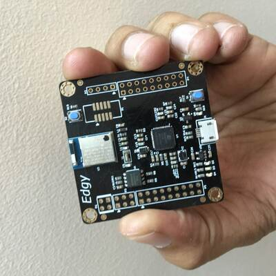

## Edgy

Edgy is a combination of nRF52840 + an iCE40UP5k FPGA.

## Notes 

I worked on this project in 2019.

I am releasing the project as open source in Feb 2022. Please note that although 
I was able to get the board up and running, I haven't looked at this project in 
a while, and cannot provide any kind of support.

## License for Hardware Files

 Edgy hardware design files are licensed under a <a rel="license" href="http://creativecommons.org/licenses/by-sa/4.0/">Creative Commons Attribution-ShareAlike 4.0 International License</a>.
